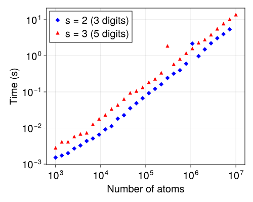

# ParticleMeshEwald

[](https://ArrogantGao.github.io/ParticleMeshEwald.jl/stable/)
[](https://ArrogantGao.github.io/ParticleMeshEwald.jl/dev/)
[](https://github.com/ArrogantGao/ParticleMeshEwald.jl/actions/workflows/CI.yml?query=branch%3Amain)
[](https://codecov.io/gh/ArrogantGao/ParticleMeshEwald.jl)

A lightweight implementation of Particle Mesh Ewald method for computing the electrostatic energy of a system of particles with triply periodic boundary conditions.
Long range part is computed with FINUFFT.jl, short range part is computed with a direct summation with CellListMap.jl and KernelAbstractions.jl.

## Usage

```julia
using ParticleMeshEwald

pme = PME(alpha, (Lx, Ly, Lz), s, N)

x = rand(N)
y = rand(N)
z = rand(N)
q = ComplexF64.(rand(N) .- sum(rand(N)) / N)

E = energy(pme, x, y, z, q)
```

## Performance

Benchmark results on a Xeon Gold 6234 CPU @ 3.30GHz with 32 cores (see `benchmark/cpu_info.txt`).
Data generated by `julia -t auto -p benchmark benchmark/pme_benchmark.jl`.


