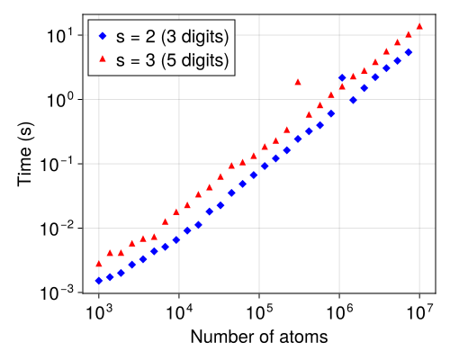

# ParticleMeshEwald

[](https://ArrogantGao.github.io/ParticleMeshEwald.jl/stable/)
[](https://ArrogantGao.github.io/ParticleMeshEwald.jl/dev/)
[](https://github.com/ArrogantGao/ParticleMeshEwald.jl/actions/workflows/CI.yml?query=branch%3Amain)
[](https://codecov.io/gh/ArrogantGao/ParticleMeshEwald.jl)

A lightweight implementation of Particle Mesh Ewald method for computing the electrostatic energy of a system of particles with triply periodic boundary conditions.
Long range part is computed with FINUFFT.jl, short range part is computed with a direct summation with CellListMap.jl.

This package is framework-free: it never constructs an ExTinyMD type, and can be used
(and tested -- see `test/standalone.jl`) with ExTinyMD never loaded. If you are using
[ExTinyMD.jl](https://github.com/HPMolSim/ExTinyMD.jl), loading it activates a package
extension that adds a method to `ExTinyMD.energy`; see "Use with ExTinyMD" below.

**Energy only, no forces.** This package has never computed forces. If you need forces or
want to drive an MD run, use ExTinyMD's own `PME3D`, which computes the same particle-mesh
Ewald method (matching `Ewald3D` to machine precision) with forces, ICM image-charge
integration, and `ExTinyMD.update_acceleration!` already wired up.

## Usage

`poses` is an array-of-structs: any `AbstractVector` whose elements support `p[1]`, `p[2]`,
`p[3]` works with no conversion -- `Vector{SVector{3,T}}` (from StaticArrays.jl),
`Vector{NTuple{3,T}}`, and ExTinyMD's `Vector{Point{3,T}}` all qualify. `charges` is a plain
`AbstractVector{<:Real}` -- the `Complex{T}` conversion FINUFFT needs internally is handled
inside `PME`'s own scratch buffers, not exposed to callers.

```julia
using ParticleMeshEwald, StaticArrays

N = 1000
L = (20.0, 20.0, 20.0)
alpha, s = 0.5, 4.0   # r_c = s/alpha = 8.0; must be < min(L)/2 = 10.0 (CellListMap enforces this)

pme = PME(alpha, L, s, N)

poses = [SVector(rand() * L[1], rand() * L[2], rand() * L[3]) for _ in 1:N]
charges = rand(N) .- sum(rand(N)) / N

E = ParticleMeshEwald.energy(pme, poses, charges)
```

Note the `r_c < min(L)/2` rule above: `r_c = s / alpha` is the real-space cutoff, and
CellListMap raises `ArgumentError: UNIT CELL CHECK FAILED` if it is not strictly less than
half the shortest periodic box side. Check this whenever you change `alpha`, `s`, or `L`.

`energy_short`/`energy_long` are also available, with the same `(pme, poses, charges)`
signature (`energy_short` additionally takes a `neighbor_list = nothing` keyword, to reuse
a list already maintained elsewhere instead of rebuilding `pme`'s own cell list).

**`PME` is exported; `energy`/`energy_short`/`energy_long` are deliberately not.** Call them
qualified, as above (`ParticleMeshEwald.energy(...)`). This is a breaking change from
earlier `0.1.0` releases, made so that five sibling packages
(QuasiEwald, EwaldSummations, FastSpecSoG, SoEwald2D, ParticleMeshEwald) can each define
their own `energy` without `using` two of them together becoming ambiguous.

None of the query functions mutate `poses` or `charges`; all scratch (scaled coordinates,
the `Complex{T}` charge buffer, the cell list) is owned by `pme` and reused across calls.

## Use with ExTinyMD

Loading `ExTinyMD` (0.3 or later) alongside this package activates an extension providing:

```julia
ExTinyMD.energy(pme, neighborfinder, sys, info)
```

`PME` cannot be placed in `sys.interactions` -- `MDSys` requires its interactions to
subtype `ExTinyMD.AbstractInteraction`, and `PME` is defined in this package's `src/`,
where ExTinyMD does not exist at compile time, so it structurally cannot satisfy that bound
while ExTinyMD remains a weak dependency. Call `ExTinyMD.energy` directly instead of through
`sys.interactions`/`simulate!`; see `test/extinymd_adapter.jl` for a worked example. There is
no `ExTinyMD.update_acceleration!` method, for the same "no forces" reason given above --
use `PME3D` if you need to drive a simulation.

## Performance

Benchmark results on a Xeon Gold 6234 CPU @ 3.30GHz with 32 cores (see `benchmark/cpu_info.txt`).
Data generated by `julia -t auto -p benchmark benchmark/pme_benchmark.jl`.


